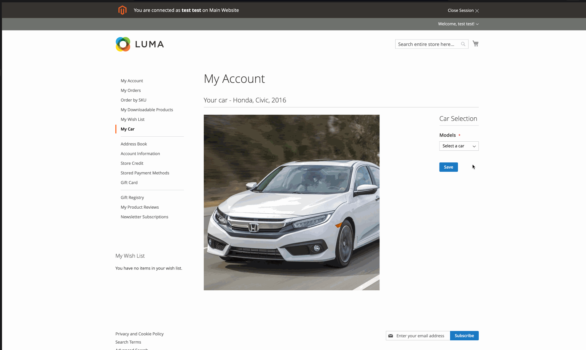

# Overview
Demo_CarProfile is module to interact with swagger API using Laminas framework.


# Notes
* Possibly it can be improved further.


# install

Add git repo

```
"repositories": [
...
    {
    "type": "git",
    "url": "https://github.com/4j4yk/Demo_CarProfile.git"
    },
...
]
```

and use composer install

```
composer require demo/module-car-profile dev-main
```

# Demo




